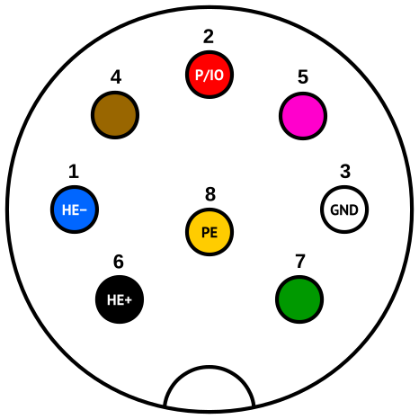
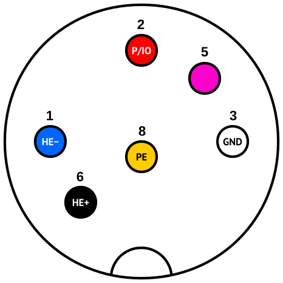
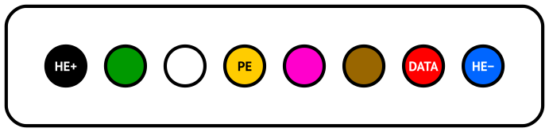
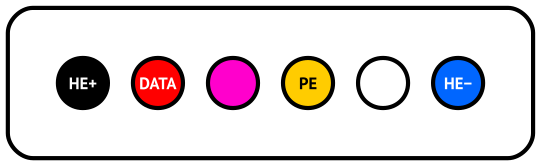
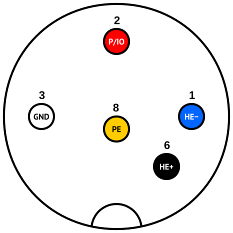
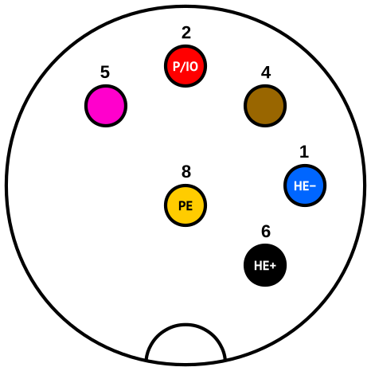

i-CON soldering station
=======================

Here we will examine interior of original [Ersa i-СON 2](http://www.kurtzersa.com/electronics-production-equipment/soldering-tools-accessories/soldering-desoldering-stations/produkt-details/i-con-2-9.html) soldering station.

Connectors
==========

Legend:

- **P/IO**: power/data line (one-wire UART, see "Communication" below)
- **PE**: protective earth
- **HE+**: heating element positive circuit
- **HE&minus;**: heating element negative circuit
- **GND**: ground

External on the station
-----------------------

Left side (accepts i-Tool, Power-Tool, Tech-tool, Micro-Tool, Chip-Tool, X-Tool):

Right side (accepts i-Tool only):

Internal in station
-------------------

Connector on i-Tool
-------------------

Connector on ChipTool
----------------------------------

Communication
=============

To communicate with i-Tool, station uses `P/IO` wire which combines both power and data. Furthermore data is half-duplex.

UART protocol is used:

- Rate: **250000 bps**
- Start bit: **1**
- Data bit: **8**
- Parity bit: **No**
- Stop bit: **1**

Data exchange
-------------

Every request from station is followed by tool response after ca. 120 μs.

Endian is little.

Request format
--------------

| Offset | Type  | Example | Description                                       |
|--------|-------|---------|---------------------------------------------------|
| 0      | u16   | 0x2F02  | Preamble (constant)                               |
| 2      | u8    | 0x05    | Message ID                                        |
| 3      | u16   | 0x0010  | Operation code                                    |
| 5      | u8    | 0x05    | Requested data length                             |
| 6      | u16   | 0x498E  | Checksum                                          |

Response format
---------------

| Offset | Type  | Example | Description                                       |
|--------|-------|---------|---------------------------------------------------|
| 0      | u16   | 0x2F02  | Preamble (constant)                               |
| 2      | u8    | 0x0A    | Message ID                                        |
| 3      | u16   | 0x0010  | Request operation code                            |
| 5      | u8    | 0x05    | Requested data length                             |
| 6      | array | 0x5E 0x0A 0x1C 0x03 0x00 | Data                             |
| n-2    | u16   | 0x8F42  | Checksum                                          |

Messages
========

Get tool ID
-----------

This data exchange is implemented every second (1 Hz) after powering station up until receiving successful response from tool.

Request:

- Message ID: **0x05**
- Operation code: **0x0001**
- Requested data length: **2**

Response:

- Message ID: **0x07**
- Data:
  * **0x2802**: i-Tool

Example (raw hex):

- Request: `02 2F`&nbsp;`05`&nbsp;`01 00`&nbsp;`02`&nbsp;`3A 4D`
- Response: `02 2F`&nbsp;`07`&nbsp;`01 00`&nbsp;`02`&nbsp;**`02 28`**&nbsp;`C1 A4`

Get tool revision
-----------------

This data exchange is implemented once during startup after getting tool ID.

Request:

- Message ID: **0x05**
- Operation code: **0x0040**
- Requested data length: **2**

Response:

- Message ID: **0x07**
- Data:
  * [0]: (u8) Minor
  * [1]: (u8) Major

Example (raw hex):

- Request: `02 2F`&nbsp;`05`&nbsp;`40 00`&nbsp;`02`&nbsp;`A7 67`
- Response: `02 2F`&nbsp;`07`&nbsp;`40 00`&nbsp;`02`&nbsp;**`00 01`**&nbsp;`D1 CC`
  * Minor: **0**
  * Major: **1**

Get status
----------

This data exchange is implemented every 20 ms (50 Hz).

Request:

- Message ID: **0x05**
- Operation code: **0x0010**
- Requested data length: **5**

Response:

- Message ID: **0x0A**
- Data:
  * [0]: (u16) Heating element temperature (Celsius * 10)
  * [2]: (u8) Handle temperature (Celsius)
  * [3]: (u16) Flags (see below)

Flags:

| 15 ... 2 |    1 |  0 |
|----------|------|----|
| RESERVED | IDLE | OK |

- `RESERVED`: Reserved for future use
- `IDLE`: **1** if tool is not moved (e.g. on stand), **0** otherwise (e.g. during active soldering)
- `OK`: **1** for no error state, **0** otherwise

Example (raw hex):

- Request: `02 2F`&nbsp;`05`&nbsp;`10 00`&nbsp;`05`&nbsp;`8E 49`
- Response: `02 2F`&nbsp;`0A`&nbsp;`10 00`&nbsp;`05`&nbsp;**`52 0A`&nbsp;`1C`&nbsp;`03 00`**&nbsp;`69 04`
  * Heating element temperature: 0x0A52 = **264.2 &deg;C**
  * Handle temperature: 0x1C = **28&deg;C**
  * Flags: 0x0003 = **IDLE | OK**

Checksum
========

- Algorithm: **CRC-CCITT (XModem)**
- Data: **entire message**, including preamble, except CRC itself

Example:

    CRC-CCITT-XModem(0x02 0x2F 0x05 0x10 0x00 0x05) = 0x498E
